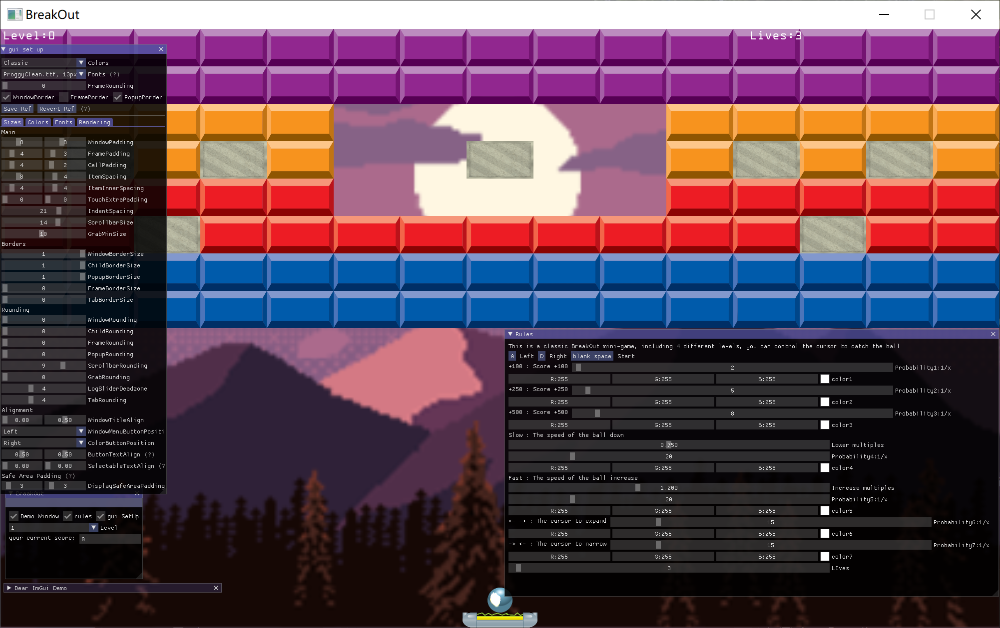

# BreakOut

这是一个敲方块小游戏，简单而又朴实，适合刚接触图形学的小伙伴上手。

## 项目介绍

​	这是我图形学课设的实习，基于`OpenGL（C++)`的小游戏。代码量小，且易懂。并且利用的的是`GLFW`与`glad`这两个`OpenGL`的新一代框架，利用`GPU`进行图像渲染。很是适合小白快速上手的项目。

## 配置说明

在`OpenGL`文件中包含有`include`、`lib`、`src`,`include`里提供了所需要用的库头文件，`lib`里含有需要的静态库与动态库，`src`提供了`glad.c`

在使用过程中，请把`include`、`lib`分别增加到项目的包含目录与库目录，把`glad.c`直接加入项目中。不要忘了输入附加依赖项

+   `freetype.lib`
+   `soil2-debug.lib`
+   `opengl32.lib`
+   `glfw3.lib`

对于`ImGUI`，这是轻量级的可视化界面。同样也需加入到项目的包含目录

## 工具介绍

### 1.`GLFW + glad`

`glfw is an Open Source, multi-platform library for OpenGL, OpenGL ES and Vulkan development on the desktop. It provides a simple API for creating windows, contexts and surfaces, receiving input and events.`

[`glfw`](https://www.glfw.org/)无愧于其号称的`lightweight`的`OpenGL`框架，的确是除了跨平台必要做的事情都没有做，所以一个头文件，很少量的`API`，就完成了任务。`glfw`的开发目的是用于替代glut的。它是一个轻量级的，开源的，跨平台的library。支持`OpenGL`及`OpenGL ES`，用来管理窗口，读取输入，处理事件等。

那么`glfw`有何优势呢？`glut`太老了，最后一个版本还是90年代的。`freeglut`完全兼容`glut`，算是`glu`t的代替品，功能齐全，但是bug太多。稳定性也不好（不是我说的啊），`glfw`应运而生。

总之，`glfw`是`glut/freegult`的升级和改进。`glfw`是用来显示窗口和捕捉窗口事件的一套`API`，可以理解成Qt和windows平台的`WPF`。`OpenGL`只是一套控制`GPU`的规则，并没有对于跨平台窗口显示和事件进行规定，所以需要一个显示显卡渲染的窗口，这就是`glfw`的作用。

`glad`是继`gl3w`，`glew`之后，当前最新的用来访问`OpenGL`规范接口的第三方库。简单说glad是`glew`的升级版，就是说`glew`比较老，glad比较新。

### 2.`glm`

专门为`OpenGL`量身定做的数学库，那就是`GLM`。`GLM`是`OpenGL Mathematics`的缩写，它是一个**只有头文件的**库，也就是说我们只需包含对应的头文件就行了，不用链接和编译。[官网]([OpenGL Mathematics (g-truc.net)](https://glm.g-truc.net/0.9.8/index.html)

### 3.`SOIL2`

SOIL是简易`OpenGL`图像库(`Simple OpenGL Image Library`)的缩写，它支持大多数流行的图像格式，并且使用简单。[官网](http://www.lonesock.net/soil.html)

### 4.`FreeType`

`FreeType`库是一个完全免费（开源）的、高质量的且可移植的字体引擎，它提供统一的接口来访问多种字体格式文件，包括`TrueType`, `OpenType`, `Type1`, `CID`,` CFF`, `Windows FON/FNT`, `X11 PCF`等。支持单色位图、反走样位图的渲染。`FreeType`库是高度模块化的程序库，虽然它是使用`ANSI C`开发，但是采用面向对象的思想，因此，`FreeType`的用户可以灵活地对它进行裁剪。

### 5. `ImGUI`

`ImGUI`又称为`Dear ImGui`，它是与平台无关的`C++`轻量级跨平台图形界面库，没有任何第三方依赖，可以将`ImGUI`的源码直接加到项目中使用，也可以编译成`dll`, `ImGUI`使用`DX`或者`OpenGL`进行界面渲染

## 游戏介绍

游戏很简单，根据小球走向移动游标，接住小球即可。

程序里面写了游戏的规则，添加了游戏道具

